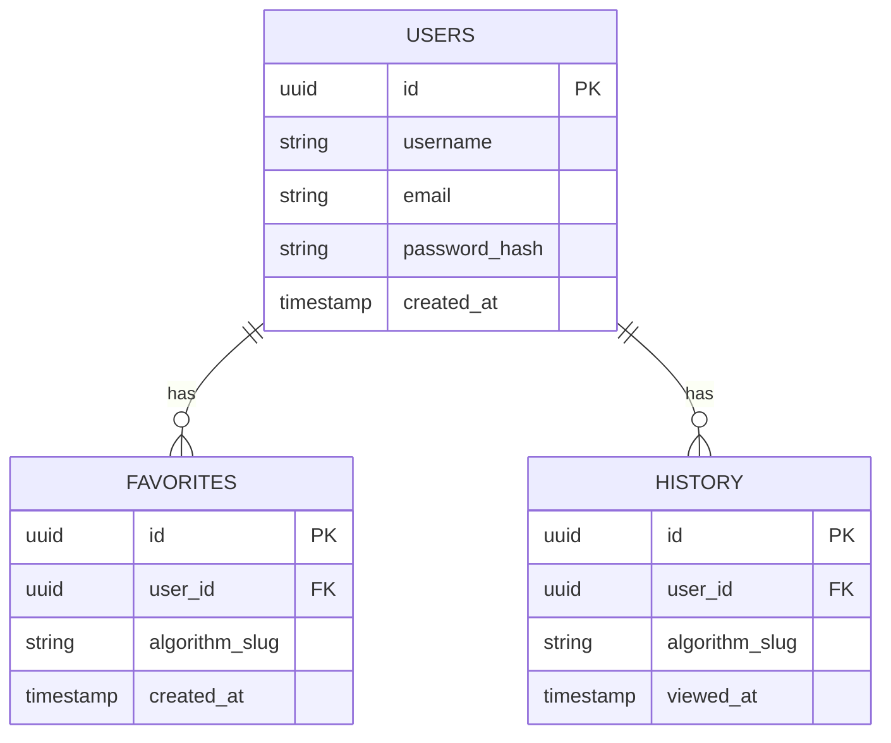

# ER diagram

Notes:
- `favorites` has a unique constraint on `(user_id, algorithm_slug)` -- favoriting is a toggle, not an append-only log.
- `history` has no such constraint -- every view is a new row, and "recently viewed" is `ORDER BY viewed_at DESC LIMIT N`.
- `algorithm_slug` is a stable identifier (`bubble-sort`, `bst`, ...), not a display name. Display names live in static metadata on both the backend (`ALGORITHM_CATALOG`) and frontend (`algorithmContent.ts`), not in the database.
